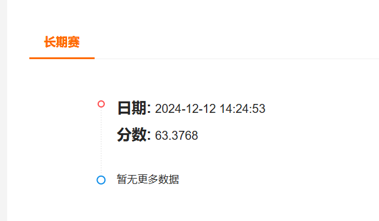

## 实验4

环境配置：pip install pyspark即可，本次环境安装极其简单

#### 任务1.1：每日总资金流入和流出计算

**设计思路：**

1. **初始化SparkContext**：使用 SparkConf 和 SparkContext 初始化 Spark 环境。
2. **读取数据**：从 `user_balance_table.csv` 文件中读取数据，并过滤掉表头。
3. **解析数据**：定义 parse_line 函数解析每一行数据，提取日期、总资金流入和总资金流出量。
4. **按日期聚合数据**：使用 reduceByKey 按日期聚合数据，计算每一天的总资金流入和总资金流出量。
5. **格式化输出**：将聚合后的数据格式化为字符串，并收集结果到驱动程序。
6. **保存结果**：将结果写入 task1.1-result.txt 文件。

#### 任务1.2：活跃用户分析

**设计思路：**

1. **初始化SparkContext**：使用 SparkConf 和 SparkContext 初始化 Spark 环境。
2. **读取数据**：从 `user_balance_table.csv` 文件中读取数据，并过滤掉表头。
3. **解析数据**：定义 parse_line 函数解析每一行数据，提取用户ID和日期。
4. **过滤数据**：过滤出2014年8月的数据。
5. **统计记录天数**：统计每个用户在2014年8月的记录天数。
6. **过滤活跃用户**：过滤出记录天数大于等于5天的活跃用户。
7. **统计活跃用户总数**：统计活跃用户的总数并输出结果。

#### 任务2：城市用户分析

**设计思路：**

1. **初始化SparkSession**：使用 SparkSession 初始化 Spark 环境。

2. **读取数据**：从 `user_balance_table.csv` 和 user_profile_table.csv 文件中读取数据。

3. 任务1

   ：计算每个城市在2014年3月1日的用户平均余额，并按平均余额降序排列。

   - 过滤出2014年3月1日的数据。
   - 关联 `user_profile_table` 获取城市信息。
   - 计算每个城市的用户平均余额，并按平均余额降序排列。

4. 任务2

   ：统计每个城市总流量前3高的用户。

   - 过滤出2014年8月的数据。
   - 计算每个用户在2014年8月的总流量。
   - 关联 `user_profile_table` 获取城市信息。
   - 计算每个城市中每个用户的总流量，并获取每个城市总流量前3高的用户。

#### 任务3：申购和赎回预测

**设计思路：**

1. **初始化SparkContext和SparkSession**：使用 SparkConf 和 SparkContext 初始化 Spark 环境，并创建 SparkSession。
2. **读取数据**：从 `user_balance_table.csv` 文件中读取数据，并过滤出2014年8月之前的数据。
3. **按日期聚合数据**：计算每天的总申购和总赎回。
4. **准备训练数据**：使用 VectorAssembler 将日期转换为特征向量。
5. **训练模型**：分别训练申购总额和赎回总额的线性回归模型。
6. **生成预测数据**：生成2014年9月的日期数据，并使用训练好的模型进行预测。
7. **格式化输出**：将预测结果转换为字符串格式，保留两位小数，并避免科学计数法。
8. **保存结果**：将结果保存到 tc_comp_predict_table 文件夹中。

得分：

不足和改进：目前仅使用了最简单的线性模型，可以考虑使用更复杂的模型，如随机森林，岭回归等，或者是使用PCA对数据先进行降维处理，增加预测准确率。

### 输出结果说明

输出结果保存在`output`文件夹下，任务1和2的结果就是有对应编号的.txt文件，任务三的预测结果位于`output/tc_comp_predict_table`文件夹下的task3-result.csv文件中。

